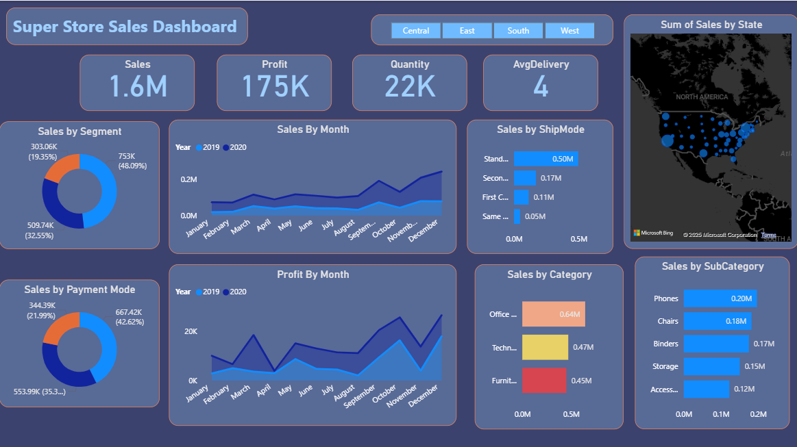

# 📊 Power BI Sales Dashboard

## 📝 Project Overview
This project is a **Sales Dashboard** built in **Power BI**, designed to help businesses monitor and analyze their sales performance effectively.  
The dashboard provides **key metrics, trends, and insights** that can be used for better decision-making.  

You can also watch the **full tutorial** on YouTube here:  
🎥 [Power BI Sales Dashboard Tutorial](https://youtu.be/fZn83JRt4Nk)  

---

## 🎯 Features
- **Sales Overview:** Track total sales, profit, and quantity sold.  
- **Interactive Filters & Slicers:** Analyze data by region, category, and date range.  
- **Trend Analysis:** Identify sales patterns over time.  
- **Top Products & Regions:** View top-performing items and areas.  
- **Clean & Professional Design:** Easy-to-read visuals for decision-making.  

---

## 🛠️ Tools & Technologies Used
- **Power BI Desktop** (Data Visualization & Dashboard Creation)  
- **Power Query** (Data Cleaning & Transformation)  
- **Excel / CSV Dataset** (Source Data)  

---

## 📂 Dataset
- Dataset used for this project is included in the `Sales/` folder *(or provide the source link if publicly available)*.  
- Contains columns like:  
  - `Order Date`  
  - `Product Category`  
  - `Sales`  
  - `Quantity`  
  - `Profit`  
  - `Region`  

---

## 📷 Dashboard Preview

  

---

## 🚀 How to Use
1. Download the `.pbix` file from this repository.  
2. Open it in **Power BI Desktop**.  
3. Connect to your own dataset if you want to customize it.  
4. Explore and interact with the visuals.

## 🏷️ Tags
`Power BI` `Sales Dashboard` `Business Intelligence` `Data Visualization` `Power Query`
